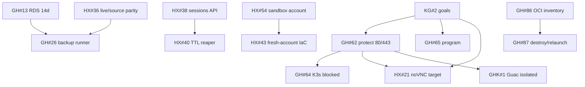

# Issue + solution knowledge graph (human)

Generated `2026-09-30T04:59:00Z`. Status: **OBSERVED**. Scanned 21 `onnxscibroccoli` repos.

Full per-issue writeups and the AI graph from this session are in the Grok artifacts (`kg/ISSUE_SOLUTION_GRAPH_HUMAN_2026-09-30.md`, `kg/issues-solutions.json`). This file is the durable repo index.

## Invariants

- Do not bind host 80/443 on the CloudFront origin (Grasshopper #62).
- Do not treat process-up as health.
- Do not promote PROVEN without an acceptance ID.
- Human remains merge and production-mutate authority.
- OCI / K3s / Guacamole are experiments around Helix, not replacements.

## Cross-repo map

## Open issues by repo (preferred next move)

### Grasshopper

| Issue | Preferred solution | Rejected |
| --- | --- | --- |
| [#87](https://github.com/onnxscibroccoli/Grasshopper/issues/87) | Destroy/relaunch OCI workstation from `oci-workstation-rebuild.sh` | Serial-console key repair |
| [#86](https://github.com/onnxscibroccoli/Grasshopper/issues/86) | Cloud Shell inventory + instance principal | Promote OCI to production origin |
| [#65](https://github.com/onnxscibroccoli/Grasshopper/issues/65) | Gate-by-gate evidence IDs | Unbounded test spawn |
| [#64](https://github.com/onnxscibroccoli/Grasshopper/issues/64) | K3s only on a second VM | Same-host Traefik |
| [#62](https://github.com/onnxscibroccoli/Grasshopper/issues/62) | Keep 80/443 invariant + preflight | Re-enable Traefik on origin |
| [#26](https://github.com/onnxscibroccoli/Grasshopper/issues/26) | Scoped SSM/EIC to backup EC2; 14 daily points | Transplant PR24 executor into PG worker |
| [#13](https://github.com/onnxscibroccoli/Grasshopper/issues/13) | Infra identity sets RDS retention >=14 | Replace RDS |

### helix

| Issue | Preferred solution | Rejected |
| --- | --- | --- |
| [#54](https://github.com/onnxscibroccoli/helix/issues/54) | Sandbox OU + SCP + short-lived identity | Management-account creds for agents |
| [#43](https://github.com/onnxscibroccoli/helix/issues/43) | Two-phase TF/OIDC bootstrap | Apply module to production account |
| [#40](https://github.com/onnxscibroccoli/helix/issues/40) | Persist expiresAt + reaper | Destroy workspace on websocket close |
| [#38](https://github.com/onnxscibroccoli/helix/issues/38) | Capability-auth `POST /api/v1/sessions` | Quick Tunnel as identity |
| [#36](https://github.com/onnxscibroccoli/helix/issues/36) | Classify live dirty files onto a review branch | `git reset --hard` production |
| [#34](https://github.com/onnxscibroccoli/helix/issues/34) | Admin recovery for orphans | First-user-wins claim |
| [#21](https://github.com/onnxscibroccoli/helix/issues/21) | Auth E2E proving guest :5901 vs host :5900 | Change 80/443 to retarget noVNC |
| [#13](https://github.com/onnxscibroccoli/helix/issues/13) | Human upgrades self-hosted runner >=2.327.1 | Drop live-hypervisor job first |
| [#6](https://github.com/onnxscibroccoli/helix/issues/6) | Authorized origin start+probe watchdog | Treat CF 504 as Xen failure |

### Other product repos

| Issue | Preferred |
| --- | --- |
| [KG #2](https://github.com/onnxscibroccoli/omn-kali-knowledge-graph-master/issues/2) | Refresh graphs each cycle; no fake PROVEN |
| [grasshopper-kubernetes #1](https://github.com/onnxscibroccoli/grasshopper-kubernetes/issues/1) | Isolated cluster + real Guac JSON/VNC gate |
| [GPTOmniKali-full-stack #2](https://github.com/onnxscibroccoli/GPTOmniKali-full-stack/issues/2) | Lab host QEMU only; never Vercel QEMU; never commit qcow2 |
| [GPTOmniKali-full-stack #1](https://github.com/onnxscibroccoli/GPTOmniKali-full-stack/issues/1) | RFB + OAuth + secret review before public |
| [kali-node #21](https://github.com/onnxscibroccoli/kali-node/issues/21) | Fill PASS/FAIL matrix; do not rebuild KVM foundation |
| [kali-node #31](https://github.com/onnxscibroccoli/kali-node/issues/31) | Atomic tickets + recover auth modules; stay private |
| [kali-node #30](https://github.com/onnxscibroccoli/kali-node/issues/30) | Close if keepers landed; proofs live on #21 |
| [kali-node #37](https://github.com/onnxscibroccoli/kali-node/issues/37) | Add keepers only; no NATS mesh |

### broccoli-core (41 open)

Parent: [#28](https://github.com/onnxscibroccoli/broccoli-core/issues/28). Constitution: [#52](https://github.com/onnxscibroccoli/broccoli-core/issues/52).

Preferred sequence: close CI leftovers (#51, #47) if green → one live action (#44 bluetooth) → keep cycle gated until harvest has real turns (#56) → merge duplicate milestone pairs (#38/#39, #32/#44, #33/#45, #34/#46, #29/#41, #30/#42, #36/#40) → Cloudflare deploy stays optional (#48/#50).

Rejected: implement M1–M10 in one PR; commit harvest logs to main; treat edge-down as product-down; burn SuperGrok quota on `api.x.ai` (#22/#23).

## PRs that GitHub counts as issues

- omnikali-link #1–#6 (orchestrator / registry / restart / docs)
- omnikali #3–#5 (evidence / agent-launch contract)

## Repos with no open issues

`ara-github-write-test`, `ara-github-write-test-2`, `android-virtual-mic-shizuku`, `dectalk-live`, `half-a-mile`, `kiln`, `lattice`, `lattice-audit`, `newsroom-desk`, `onnxscibroccoli.github.io`, `shizuku-silent-mic`, `shizuku-virtual-mic`.
