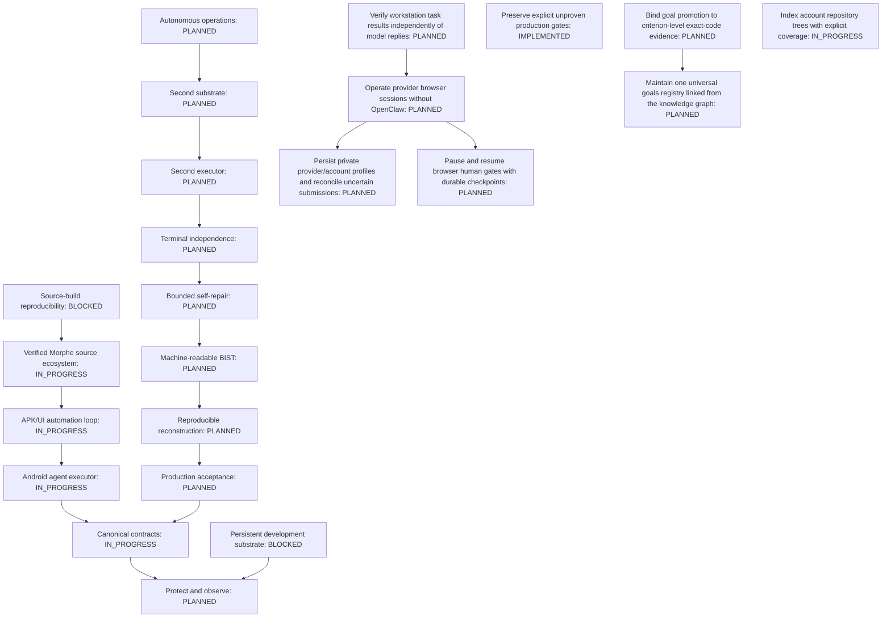

# Universal goals

Registry revision: 0. Generated from `goals/universal.json`.

| Goal | Owner | Evidence status | Next action |
|---|---|---|---|
| ARCH-G0 — Protect and observe | onnxscibroccoli/helix | PLANNED | Reconcile historical goal with exact acceptance evidence |
| ARCH-G1 — Canonical contracts | onnxscibroccoli/Grasshopper | IN_PROGRESS | Reconcile historical goal with exact acceptance evidence |
| ARCH-G10 — Android agent executor | onnxscibroccoli/Grasshopper | IN_PROGRESS | Reconcile historical goal with exact acceptance evidence |
| ARCH-G11 — APK/UI automation loop | onnxscibroccoli/Grasshopper | IN_PROGRESS | Reconcile historical goal with exact acceptance evidence |
| ARCH-G12 — Verified Morphe source ecosystem | onnxscibroccoli/morphe-manager | IN_PROGRESS | Reconcile historical goal with exact acceptance evidence |
| ARCH-G13 — Source-build reproducibility | onnxscibroccoli/Grasshopper | BLOCKED | Reconcile historical goal with exact acceptance evidence |
| ARCH-G14 — Persistent development substrate | onnxscibroccoli/Grasshopper | BLOCKED | Reconcile historical goal with exact acceptance evidence |
| ARCH-G2 — Production acceptance | onnxscibroccoli/helix | PLANNED | Reconcile historical goal with exact acceptance evidence |
| ARCH-G3 — Reproducible reconstruction | onnxscibroccoli/Grasshopper | PLANNED | Reconcile historical goal with exact acceptance evidence |
| ARCH-G4 — Machine-readable BIST | onnxscibroccoli/Grasshopper | PLANNED | Reconcile historical goal with exact acceptance evidence |
| ARCH-G5 — Bounded self-repair | onnxscibroccoli/Grasshopper | PLANNED | Reconcile historical goal with exact acceptance evidence |
| ARCH-G6 — Terminal independence | onnxscibroccoli/Grasshopper | PLANNED | Reconcile historical goal with exact acceptance evidence |
| ARCH-G7 — Second executor | onnxscibroccoli/Grasshopper | PLANNED | Reconcile historical goal with exact acceptance evidence |
| ARCH-G8 — Second substrate | onnxscibroccoli/Grasshopper | PLANNED | Reconcile historical goal with exact acceptance evidence |
| ARCH-G9 — Autonomous operations | onnxscibroccoli/Grasshopper | PLANNED | Reconcile historical goal with exact acceptance evidence |
| GH-ARTIFACT-001 — Verify workstation task results independently of model replies | onnxscibroccoli/Grasshopper | PLANNED | Implement and verify acceptance criteria |
| GH-BIST-001 — Preserve explicit unproven production gates | onnxscibroccoli/Grasshopper | IMPLEMENTED | Verify criterion-level evidence |
| GH-BROWSER-001 — Operate provider browser sessions without OpenClaw | onnxscibroccoli/Grasshopper | PLANNED | Implement and verify acceptance criteria |
| GH-BROWSER-002 — Persist private provider/account profiles and reconcile uncertain submissions | onnxscibroccoli/Grasshopper | PLANNED | Implement and verify acceptance criteria |
| GH-BROWSER-003 — Pause and resume browser human gates with durable checkpoints | onnxscibroccoli/Grasshopper | PLANNED | Implement and verify acceptance criteria |
| KG-GOALS-001 — Maintain one universal goals registry linked from the knowledge graph | onnxscibroccoli/omn-kali-knowledge-graph-master | PLANNED | Implement and verify acceptance criteria |
| KG-GOALS-002 — Bind goal promotion to criterion-level exact-code evidence | onnxscibroccoli/omn-kali-knowledge-graph-master | PLANNED | Implement and verify acceptance criteria |
| KG-INVENTORY-001 — Index account repository trees with explicit coverage | onnxscibroccoli/omn-kali-knowledge-graph-master | IN_PROGRESS | Implement and verify acceptance criteria |

The narrative accompanies this diagram. Implementation, test proof and live proof are separate.
