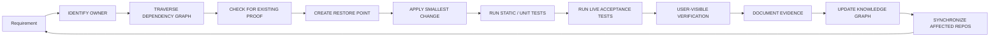

# Agent orchestration loop

```mermaid
flowchart LR
  Requirement --> Identify[IDENTIFY OWNER]
  Identify --> Traverse[TRAVERSE DEPENDENCY GRAPH]
  Traverse --> Proof[CHECK FOR EXISTING PROOF]
  Proof --> Restore[CREATE RESTORE POINT]
  Restore --> Change[APPLY SMALLEST CHANGE]
  Change --> UnitTest[RUN STATIC / UNIT TESTS]
  UnitTest --> LiveTest[RUN LIVE ACCEPTANCE TESTS]
  LiveTest --> Verify[USER-VISIBLE VERIFICATION]
  Verify --> Document[DOCUMENT EVIDENCE]
  Document --> UpdateGraph[UPDATE KNOWLEDGE GRAPH]
  UpdateGraph --> Sync[SYNCHRONIZE AFFECTED REPOS]
  Sync --> Requirement
```

If two repositories appear to own the same responsibility, stop and resolve ownership first.
